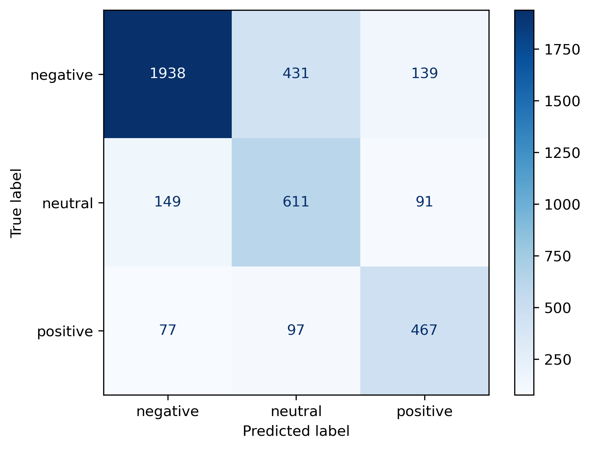

# Airline Sentiment Analysis

Sentiment Classification of Tweets about US airlines using NLP and machine learning

## Dataset
- **Source:** [Kaggle - Twitter Airline Sentiment](https://www.kaggle.com/datasets/crowdflower/twitter-airline-sentiment)
- **Training data:** 11,000 tweets
- **Classes:** Positive, Negative, Neutral

## Project Structure 

airline-sentiment-analysis/
|-----data/
|   |----raw/
|   |----processed/
|-----notebooks/
|   |----analysis.ipynb     # Main analysis notebook
|-----src/
|   |----data_processing.py     # Text cleaning functions
|-----models/       # saved models
|-----outputs/      # visualizations
|
|-----README.md

## Methodology

### 1. Data Preprocessing
- Removed @mentions, URLs, punctuations
- Lemmatization using spacy
- Removed stopwords using spacy
- Removed domain-specific words

### 2. Feature Engineering
- TF-IDF vectorization with nrams
- Label encoding for sentiment classes

## 3. Model Training
- Algorithm : Logistic Regression with balanced class_weights

## Results

**Overall Accuracy :** 75.4%

**F1 Scores by Class :**
- Negative : 0.83
- Positive : 0.70
- Neutral : 0.61

### Key Findngs
- Model performs best on negative sentiment
- Neutral sentimetn is most challenging to classify

### Confusion Matrix

## How to Run

1. Install dependencies:
'''bash
pip install -r requirements.txt
python -m spacy download en_core_web_sm
2. Open and run the notebook:
jupyter notebook notebooks/analysis.ipynb